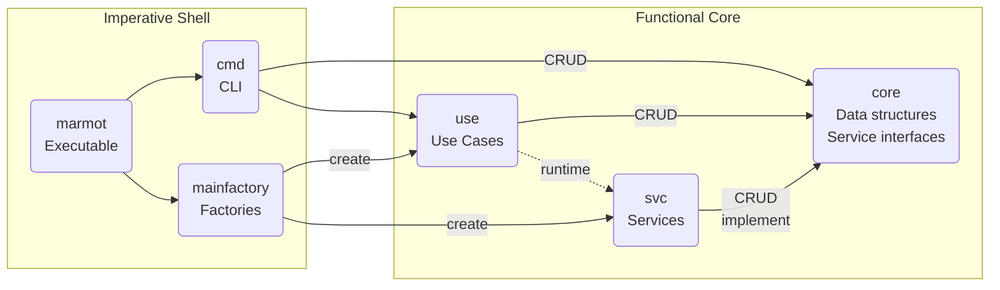
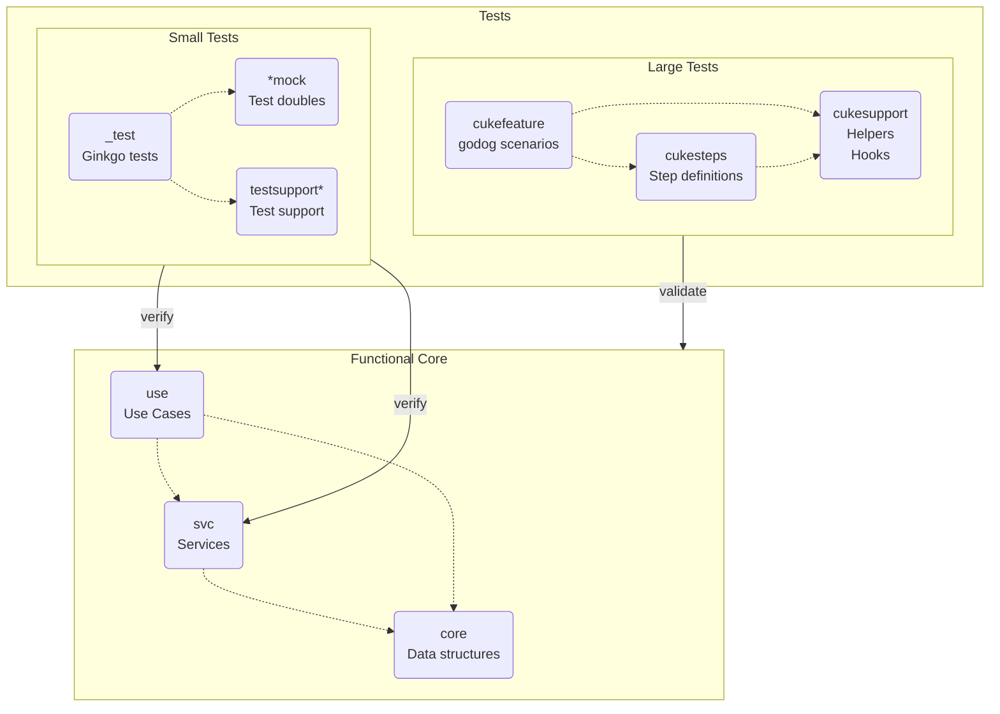
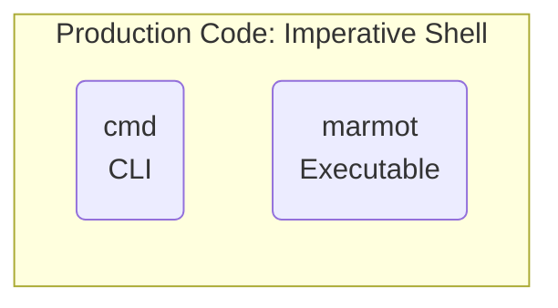

# Decision Log

A brief description of some of the major decisions along the way.

## 00: Starting conditions

With a growing network of Git repositories that are hosted in a variety of locations, I often find
myself wanting to run `git grep` on several repositories at once.

Could there be a way to arbitrarily group, query, and operate upon several repositories at once?
For example, a `language` category might have sub-categories like `java` and `typescript`, or a
`project` category might have sub-categories for each project you have worked on.

Could there be a way to build my own logical structure of somebody else's code, without having to
talk them into condensing their code into a multi-repo?  Could that help manage disjointed code?

Building a meta repo could help, but I would need a tool to maintain it.  Let's call it the Meta
Repo Management Tool, or "marmot" for short.

### Decisions

- Create a tool that tags Git repositories with categories and sub-categories and lets me run.
  shell commands for a category of repositories as if they are all part of a single unit.
- Store meta data about categories externally, instead of in the Git repositories themselves.

## 01: ~~Target Z Shell~~

Superseded by: [Implement in Go](#06-implement-in-go).

Implement marmot in *nix tools that are widely-available on the platforms I use - e.g. MacOS, Linux,
and Windows Subsystem for Linux.  Writing it in Z Shell can make it easier to try new ideas, while
avoiding the need to port or re-build for other platforms.  Breaking the scripts up into commands
and sub-commands (ala Git) can help keep the size of each script manageable.

### Decisions

- marmot is a program with a command line interface, using a Git-like command/sub-command style.
- Write marmot with Z Shell scripts.
- Delegate to tools from commonly-available packages in MacOS and Linux.

## 02: Store metadata in JSON files

I don't know exactly what kind of meta data marmot will need to store about Git repositories, aside
from categories and paths to repositories.  Storing this data in JSON files can make it possible to
extend with new fields, fix by hand when necessary, and query with tools like `jq`.

Categorizations are other meta data may grow over time, as I learn more about the Git repositories I
am using.  Maybe it might even grow into some sort of neural network of Git repositories?  Storing
the Meta Repo's contents in a separate Git repository would make it possible to track changes, roll
back, or even share with teammates.

### Decisions

- Store meta data in JSON files.
- ~~Use tools like `jq` and `jo` to query and construct JSON data from marmot.~~
- Store meta data in its own Git repository.

## 03: Directory Structure in the Meta Repo

Sometimes I need to search in several Git repositories that use the same programming language. Other
times, I do full-stack development in all the languages used for a product.  Each repository can be
in more than 1 category, so there is no, single directory structure that works in every case.
Creating a directory structure of categories that link back to the Git repositories can help manage
this complexity.  Version managers for Node.js and Ruby come to mind, as sources of inspiration.

Git repositories still have to be cloned somewhere, though.  The host/repository structure of Golang
(e.g. `go get ...`) comes to mind, as a way to avoid name collisions.

### Decisions

- Clone Git repositories in a common location, separated by host - e.g. `$HOME/git/:host/:name`.
- Create directories in the Meta Repo for each (sub-)category - e.g.
  `$HOME/meta/:category[/:sub-category]`.
- Create symbolic links in (sub-)category directories that link to the underlying Git repositories.

## 04: Use Semantic Versioning

Use a semantic versioning system with fairly objective criteria, to avoid prolonged deliberation
over what changes merit what kind of version bump.

### Decisions

- Major version: Increment from 0.x to 1.x when there are enough features to be useful.
- Minor version: Increment when adding a new feature (e.g. a command or sub-command).
- Patch version: Increment when refactoring to prepare for another feature.

## 05: ~~Apply Single Responsibility Principle to scripts~~

Superseded by: [Implement in Go](#06-implement-in-go).

Scripts are getting more complex, leading to duplication of concepts and algorithms.  Applying the
Single Responsibility Principle (SRP) can help manage complexity and avoid unnecessary duplication.
This may drive adoption of other SOLID principles, as well.

### Decisions

#### Function structure

- Write shared code as functions, using a functional style (e.g. command-query separation).
- Commands: Make separate functions for separate side-effects.
- Queries:
  - Pass data in as parameters, using quotes for any variables that may contain whitespace.
  - Pass arrays as `"${my_array[@]}"` so the whole array is passed instead of just the first word.
  - Try returning data via `echo` or `printf`, at first.  This incurs a performance penalty of the
    call site having to fork a sub-shell, but this is not expected to be a concern in practice.
  - If queries must be invoked without starting a sub-shell, environment variables `REPLY` and
    `reply` may be used to return conventional data and arrays, respectively.

Source: <https://unix.stackexchange.com/a/365417/37734>

#### Location of shared code

- Put shared code in `lib/`.
- Gather together shared functions that operate on the same bounded context (e.g. the same data).
  Explore a convention of making that bounded context the first parameter in each function.
- Name files according to their bounded context.

#### Using shared code

- Use `_MARMOT_HOME` set in the top level `marmot.zsh` script to locate shared code scripts.
- Source code from (sub-)command scripts (e.g. the script used to start the process), ala Rails.
  - Some code in `lib/` may depend upon other code in `lib/`, but it is up to the top-level script
    to `source` dependencies and transitive dependencies.
  - This is approach is intended to avoid any complexities in the same code being sourced twice.  I
    have no idea what could happen then, and I'd rather not have to find out.

## 06: Implement in Go

Supersedes: [Target Z Shell](#01-target-z-shell).

Compartmentalizing and organizing scripts helped with maintenance and extension, but it still became
difficult to split machine- and repository-specific data into separate files.  Use of an external
data migration script provided a limited means to detect bugs by including some semi-formal test
automation, but it relied heavily upon the development platform; e.g. it used real Git repositories
on specific paths.

These factors led to some thinking about which language could replace the shell scripts.  It would
need to be capable of targeting the same platforms, while offering a better means to structure data,
look up references, and refactor call sites.  It would also need robust tools for test automation
and for creating Command Line Interfaces.  Go offers all of those, while currently being a bit
easier to deploy to end users than Python or Ruby.  Go also has potentially-compelling libraries
such as [`bubbletea`](https://github.com/charmbracelet/bubbletea), which raises the possibility of
making `marmot` more interactive and easier to use.

### Decision

Sprout a new codebase written in Go, until it has enough features to replace the ZSH version.

## 07: Go package structure

Developers will need a safe and effective way to add new entities and CLI commands, in order to add
new features.  Distinguishing core entities (e.g. repositories and categories) and behavior (e.g.
categorizing Git repositories) from implementation details (e.g. interaction with the file system)
minimizes the amount of existing code that has to be modified in order to add new entities.

### Decisions

Structure Go code along these dimensions:

- Put all code in one repository.  Use Go packages to distinguish the parts.
- Create `core` packages like `corerepository` for basic entities, data structures, and interfaces.
- Create `use` packages like `userepository` for operations upon each context.
- Create `svc` packages like `svcfs` for service implementations, such as using the file system.
- Create `main` package(s) like `mainfactory` to create dependencies and wire everything together.

This leads to the following dependencies (compile-time; runtime dependencies are dashed lines) among
top-level packages:

Note: The code in the "functional core" is not always necessarily written in a functional style,
although that's an idea worth considering.

## 08: Go test strategy

As described in [Implement in Go](#06-implement-in-go), using a script-based architecture did not
offer a sufficiently-granular approach to testing.  Prior experiences with formal testing tools–i.e.
[`bats`](https://github.com/sstephenson/bats)–proved impractical for team sizes greater than one.

Another factor involved in [Go package structure](#07-go-package-structure) relates to test
automation: Separating packages by bounded context also offers a practical means to distinguish test
automation that is more highly rewarding from that which is somewhat less rewarding.  In other
words, tests on invariants and core logic tend to be easier to write and survive refactoring, while
tests on wiring and implementation details tend to be harder to write and are more readily thrown
out during refactoring.

### Decisions

- Focus test automation on core logic; e.g. "test from the middle".
- For small- to medium-sized tests of regular code:
  - **Sources**: Co-locate with production code and package as `_test`, according to Go conventions.
  - **Support code**: Add `testsupport` packages as necessary.
  - **Test doubles**: Create additional `*mock` packages as necessary, such as `corerepositorymock`.
  - **Tools**: Use `ginkgo` to clearly describe behavior.
- For medium- to large-sized tests of user-facing features:
  - **Sources**: place sources in separate `cuke*` packages.
  - **Support code**: Add `cukesupport` as necessary.
  - **Tools**: Use `godog` to clearly describe features in Gherkin.

### Control Flow

### Not Tested

